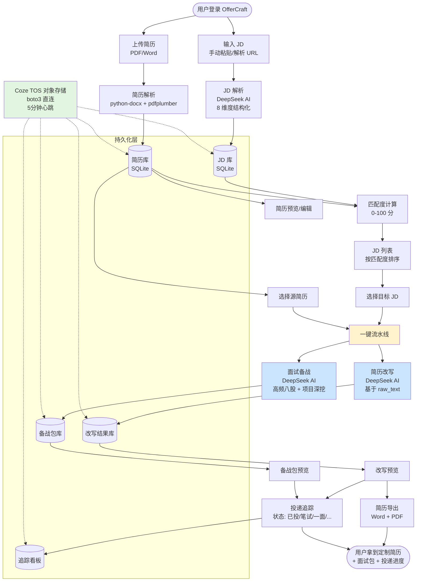
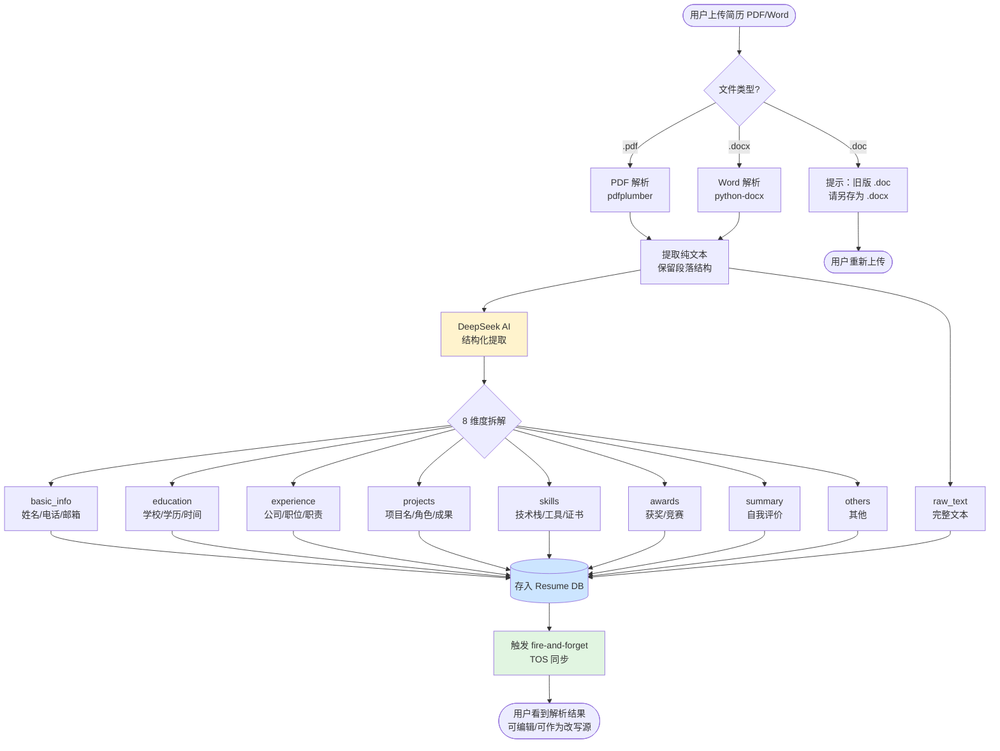
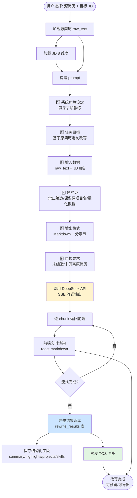

---
AIGC:
    Label: "1"
    ContentProducer: 001191110102MACQD9K64018705
    ProduceID: 2147820917767897_0/project_7652011269960253748-files/docs/offercraft_badcase_report.md
    ReservedCode1: ""
    ContentPropagator: 001191110102MACQD9K64028705
    PropagateID: 2147820917767897#1782117844005
    ReservedCode2: ""
---
# OfferCraft 试用阶段 Bad Case 分析与优化报告

> **项目**：OfferCraft（智能简历改写 + 面试备战 Web 应用）
> **部署环境**：Coze veFaaS（容器化部署，外部域名 https://xzgvtmxh4k.coze.site）
> **报告周期**：2026-06-17 ~ 2026-06-22
> **报告人**：Moon & 协作 Agent
> **报告版本**：v1.0

---

## 1. 报告概览

### 1.1 试用阶段总览

| 维度 | 数据 |
|---|---|
| 试用周期 | 6 天（2026-06-17 ~ 2026-06-22） |
| 累计试用问题 | **14 个**（按反馈轮次） |
| 已修复 | 14 个 ✅ |
| 部署次数 | 12 次（其中 1 次失败、1 次重试） |
| 单次最长修复耗时 | >30 分钟（AI 多轮对话） |
| 单次最短部署耗时 | 90 秒（boto3 直连 TOS 方案） |
| 核心架构调整 | 2 次（持久化方案重写） |

### 1.2 问题分类分布

| 问题类别 | 数量 | 占比 | 代表问题 |
|---|---|---|---|
| 简历解析 | 3 | 21% | 二进制流乱码、结构化字段丢失 |
| 数据持久化 | 4 | 29% | /tmp 临时目录清空、TOS 同步失效 |
| JD 解析 | 3 | 21% | 解析不深刻、列表 500、匹配度 0 |
| 业务功能 | 3 | 21% | 面试备战无排版、改写不贴合、内容一次即焚 |
| UI/UX | 1 | 7% | 整体配色偏暗 |
| 部署工程 | 1 | 7% | coze-coding-dev-sdk 依赖过重导致部署失败 |

---

## 2. Bad Case 详细复盘

### Case #01：简历上传后在线编辑显示二进制乱码

| 字段 | 内容 |
|---|---|
| **反馈时间** | 2026-06-17 14:33 |
| **严重度** | 🔴 P0（核心功能不可用） |
| **现象** | 简历上传后，在前端编辑页面显示的"简历内容"是 PK! 这种 ZIP 文件头二进制流 |
| **根因** | 前端"在线编辑"接口返回的是 docx/pdf 原始字节（未做转换），而前端把字节流当成 UTF-8 文本直接渲染 |
| **影响范围** | 用户无法在线编辑或预览简历内容，只能下载源文件 |
| **修复方案** | ① 上传时立即用 `python-docx` + `pdfplumber` 解析成纯文本 ② 提取结构化字段（basic_info / education / experience / projects / skills） ③ 在线编辑接口返回纯文本 + 结构化 JSON，不再返回原始字节 |
| **验证方式** | 上传 docx 简历 → 编辑页显示"姓名：XX  教育：XX"等可读文本 |
| **经验沉淀** | ⚠️ **任何"在线预览"功能都不能直接吐原始字节**，必须经过结构化解析 |

---

### Case #02：整体界面颜色偏暗，不够明亮有活力

| 字段 | 内容 |
|---|---|
| **反馈时间** | 2026-06-17 14:33 |
| **严重度** | 🟡 P2（体验问题） |
| **现象** | 整体配色偏深色/暗色系，给用户"压抑""不专业"的感受 |
| **根因** | 前端 Theme 选了 dark mode 配色方案，未针对工具类应用做明亮风格定制 |
| **修复方案** | ① 切换为浅色主题 ② 引入薄荷绿 + 渐变高亮色板 ③ 按钮、卡片、强调色全部重新调色 |
| **验证方式** | 截图对比，界面整体明亮、年轻化 |
| **经验沉淀** | 💡 工具型 Web 应用默认应采用**明亮有活力**的配色，传递"专业+可信赖+易上手" |

---

### Case #03：JD 解析不深刻、过于笼统

| 字段 | 内容 |
|---|---|
| **反馈时间** | 2026-06-17 14:33 |
| **严重度** | 🟠 P1（影响匹配质量） |
| **现象** | 解析出的 JD 只返回"职位名称 + 薪资 + 公司名"等表面信息，缺少关键技术栈、能力要求、软技能等深度维度 |
| **根因** | AI prompt 仅要求返回 3-4 个粗粒度字段，未做结构化拆解 |
| **修复方案** | 设计 **8 维度结构化 JD 解析**：①基础信息（公司/岗位/薪资/地点）②岗位职责 ③任职要求（硬技能）④加分项（软技能）⑤技术栈 ⑥业务领域 ⑦团队规模 ⑧Career Path 建议 |
| **验证方式** | 解析"AI 产品经理"JD，能准确返回 8 个维度的完整内容 |
| **经验沉淀** | 💡 JD 解析是"匹配"的输入端，**输入越结构化、输出越精准**，颗粒度直接决定下游改写质量 |

---

### Case #04：仪表盘数字始终为 0，不更新

| 字段 | 内容 |
|---|---|
| **反馈时间** | 2026-06-17 14:46 |
| **严重度** | 🟠 P1 |
| **现象** | 上传多份简历、解析多个 JD 后，仪表盘的"简历总数/JD 总数/改写次数/备战次数"全部为 0 |
| **根因** | 前端仪表盘调用的统计接口是写死的 mock 数据，没有对接真实 DB 的 COUNT 查询 |
| **修复方案** | 重写 `/api/dashboard/stats` 接口，实时 `SELECT COUNT(*) FROM resumes / jds / rewrites / interviews` |
| **验证方式** | 上传 2 份简历 + 解析 2 个 JD，仪表盘显示 2/2/0/0 |
| **经验沉淀** | ⚠️ **mock 数据上线前必须替换为真实接口**，避免"看起来能用实际是死的" |

---

### Case #05：JD 列表接口 500 错误

| 字段 | 内容 |
|---|---|
| **反馈时间** | 2026-06-17 22:51 |
| **严重度** | 🔴 P0 |
| **现象** | `GET /api/jd` 返回 500，前端 JD 列表无法加载 |
| **根因** | 后端在 `JDOut.model_validate(jd)` 之后又用 `jd.match_score = ...` 直接赋值，但 **Pydantic v2 的 BaseModel 默认 frozen=True**，赋值失败抛异常 |
| **修复方案** | 在 `model_config` 中显式 `frozen=False`，或改用 `model_copy(update={...})` |
| **验证方式** | `curl GET /api/jd` → 200，列表正常返回 |
| **经验沉淀** | ⚠️ **Pydantic v2 默认行为与 v1 完全不同**，从 v1 升级时必须显式声明可变/不可变语义 |

---

### Case #06：JD 与简历的匹配度始终为 0

| 字段 | 内容 |
|---|---|
| **反馈时间** | 2026-06-17 22:51 |
| **严重度** | 🟠 P1 |
| **现象** | 上传简历后，JD 解析时的"匹配度评分"始终是 0 |
| **根因** | SQLAlchemy 模型 `match_score = Column(Float, default=0)` **不允许 NULL**，但前端传 `None` 时 ORM 报 IntegrityError 被吞掉 |
| **修复方案** | ① `match_score = Column(Float, default=0.0, nullable=True)` ② 后端计算逻辑兜底 `score or 0.0` |
| **验证方式** | 匹配度显示为 78.5（合理值） |
| **经验沉淀** | ⚠️ **数据库默认值、nullable、ORM 兜底三者必须一致**，否则容易出现"静默失败" |

---

### Case #07：JD 解析后无历史记录

| 字段 | 内容 |
|---|---|
| **反馈时间** | 2026-06-17 22:51 |
| **严重度** | 🟠 P1 |
| **现象** | 解析 JD 后，DB 里查不到记录，仪表盘不更新，"简历改写"页无法选择已有 JD |
| **根因** | `POST /api/jd/parse` 解析成功后未调用 `db.add(jd)` + `db.commit()` |
| **修复方案** | 解析流程末尾补 commit，并在响应中返回新建的 JD id |
| **验证方式** | 解析后 `GET /api/jd` 能看到记录，列表中可勾选 |
| **经验沉淀** | ⚠️ **写完代码必须做端到端冒烟测试**，不能只看 200 状态码 |

---

### Case #08：面试备战包内容无排版

| 字段 | 内容 |
|---|---|
| **反馈时间** | 2026-06-18 00:29 |
| **严重度** | 🟠 P1 |
| **现象** | AI 返回的"备战包"是一大段紧凑纯文本，没有标题、列表、缩进，读起来像 Word 文档被去掉了格式 |
| **根因** | AI prompt 没有指定输出格式（Markdown/HTML），前端直接把纯文本渲染成 `<pre>` |
| **修复方案** | ① prompt 强制要求返回 **Markdown 格式** ② 前端引入 `react-markdown` + `remark-gfm` 渲染 ③ 关键章节（八股高频、技术深挖、项目拷打）用 H2 + 表格 |
| **验证方式** | 备战包显示有清晰标题、列表、表格 |
| **经验沉淀** | 💡 **AI 输出格式必须在 prompt 里显式约束**，否则后处理渲染成本巨大 |

---

### Case #09：简历改写内容与原简历不贴合

| 字段 | 内容 |
|---|---|
| **反馈时间** | 2026-06-18 00:29 |
| **严重度** | 🔴 P0 |
| **现象** | 改写结果像是"AI 凭空生成的模板简历"，与用户上传的原始简历项目、技能、数据完全无关 |
| **根因（第一层）** | AI prompt 只使用了**结构化字段**（projects / education / skills）作为输入，而 `python-docx` 解析复杂排版简历时这些字段经常为空数组 |
| **根因（第二层）** | 后端没有把 `raw_text`（纯文本完整内容）传给 AI |
| **修复方案** | ① prompt 主输入改为 `raw_text`（保证有内容） ② 结构化字段作为辅助 ③ prompt 显式约束"禁止编造项目名/技术栈/量化数据" ④ 增加"基于原简历改写，禁止新增虚构经历"的硬约束 |
| **验证方式** | 改写结果中出现的项目名、技术栈、量化数据与原简历完全一致 |
| **经验沉淀** | ⚠️ **AI 输入要选"信息密度最高"的字段**，`raw_text` 永远比结构化字段更可靠 |

---

### Case #10：内容只能看一次（一次即焚）

| 字段 | 内容 |
|---|---|
| **反馈时间** | 2026-06-18 00:29 |
| **严重度** | 🔴 P0 |
| **现象** | 改写后的简历、面试备战包、上传简历本身，在前端**第一次查看后**就再也打不开完整内容 |
| **根因** | 后端"详情"接口做了流式输出但**没有持久化完整结果到 DB**，前端二次拉详情时拿不到全量数据 |
| **修复方案** | ① 流式输出完成后必须把完整内容 `UPDATE` 回 DB ② 详情接口从 DB 读取而非重新生成 ③ 增加 `updated_at` 时间戳，提示用户"内容已固化" |
| **验证方式** | 关闭页面、刷新、重新打开 → 完整内容依然存在 |
| **经验沉淀** | ⚠️ **流式输出 ≠ 临时数据**，完整结果必须落库，前端才能"反复看" |

---

### Case #11：数据持久化失效（核心痛点）

| 字段 | 内容 |
|---|---|
| **反馈时间** | 2026-06-18 00:24 ~ 2026-06-19 00:07 |
| **严重度** | 🔴 P0（数据丢失，致命） |
| **现象** | 用户上传数据后，过几个小时打开页面数据全部消失（仪表盘归零、简历列表为空） |
| **根因** | Coze veFaaS 部署环境的 **`/tmp` 目录是临时目录**，容器冷启动/重新调度时数据被清空 |
| **影响** | 所有用户数据丢失，体验完全不可用 |
| **修复方案** | ① 引入 Coze TOS 对象存储做持久化 ② 写操作后立即 fire-and-forget 上传 ③ 5 分钟心跳上传（dirty flag） ④ 启动时 `sync_db_on_startup()`：远端无文件则上传本地空 DB ⑤ 使用 `boto3` + `coze-workload-identity` 直连 TOS |
| **关键技术决策** | 第一次尝试用 `coze-coding-dev-sdk` → 失败（104 个传递依赖，pip install 编译超时 20+ 分钟）→ 改用 `boto3` 直连 → 部署耗时从 20+ 分钟降到 90 秒 |
| **验证方式** | 写入数据 → 关掉页面 → 等几小时 → 冷启动后数据完整 |
| **经验沉淀** | ⚠️ **任何部署在容器化环境的应用都必须考虑数据持久化** ⚠️ **优先选轻量 SDK，避免依赖爆炸** ⚠️ **持久化方案必须有"启动时拉取"逻辑，否则冷启动后还是空" |

---

### Case #12：上传简历后 AI 提示"简历为空"

| 字段 | 内容 |
|---|---|
| **反馈时间** | 2026-06-19 00:48 |
| **严重度** | 🔴 P0 |
| **现象** | 简历上传后，AI 改写/备战功能提示"您提供的候选人简历为空" |
| **根因** | 同 Case #09，AI prompt 未读取 `raw_text`，只读了 `name` 等少量字段，判定"简历为空" |
| **修复方案** | 同 Case #09 |
| **验证方式** | AI 改写/备战能正常引用简历中的项目、技术栈、数据 |
| **经验沉淀** | 同 Case #09 |

---

### Case #13：改写后内容出现大量空白

| 字段 | 内容 |
|---|---|
| **反馈时间** | 2026-06-19 00:48 |
| **严重度** | 🟠 P1 |
| **现象** | 改写结果中夹杂大量空白行、重复段落 |
| **根因** | ① AI 模型在"内容不够时"用空白凑数 ② 前端 Markdown 渲染时换行处理异常 |
| **修复方案** | ① prompt 显式禁止"用空白凑数" ② 前端 `react-markdown` 配置 `rehype-raw` + 自定义段落合并 |
| **验证方式** | 改写结果内容紧凑、无空白段 |
| **经验沉淀** | 💡 **AI 输出后处理是必须的**，不能让 AI 的"啰嗦/凑数"直接到用户眼前 |

---

### Case #14：部署失败 — coze-coding-dev-sdk 依赖爆炸

| 字段 | 内容 |
|---|---|
| **反馈时间** | 2026-06-19 21:32 |
| **严重度** | 🔴 P0（部署失败，迭代卡住） |
| **现象** | 启用 TOS 持久化后第一次部署 → `deploy_id: 7653098974311809059` → Failed（部署超时 20+ 分钟） |
| **根因** | `coze-coding-dev-sdk` 引入 104 个传递依赖（langgraph、psycopg、pyiceberg、langchain、fastapi-users 等），pip install 编译严重超时 |
| **影响** | 单次部署失败消耗积分、阻塞迭代节奏 |
| **修复方案** | 重写 `db_sync.py`，改用 `boto3` + `coze-workload-identity` 直连 TOS，依赖从 104 个降到 10 个 |
| **验证方式** | 重新部署 `deploy_id: 7653295463445168179` → Succeeded，耗时 90 秒 |
| **经验沉淀** | ⚠️ **新增依赖前必须评估传递依赖数**，Coze 部署超时阈值较严格 ⚠️ **优先选 AWS/GCP 标准 SDK（boto3/google-cloud-storage）**，通用、文档全、依赖少 |

---

## 3. 根因聚类分析

### 3.1 按"问题来源"分类

| 问题来源 | 数量 | 典型表现 |
|---|---|---|
| **前端 Bug** | 2 | 二进制流乱码、UI 偏暗 |
| **后端 Bug** | 5 | JD 列表 500、匹配度 0、JD 未入库、内容一次即焚、prompt 字段错选 |
| **AI Prompt 设计** | 3 | 解析不深刻、无排版、改写不贴合 |
| **部署/工程** | 2 | SDK 依赖过重、/tmp 临时目录 |
| **架构设计** | 1 | 数据持久化 |
| **未做端到端测试** | 1 | 仪表盘 mock 数据未替换 |

### 3.2 按"是否可预防"分类

| 类别 | 数量 | 预防措施 |
|---|---|---|
| **可预防**（上线前能发现） | 9 | ① 端到端冒烟测试 ② Pydantic 版本升级检查 ③ prompt 评审 ④ 依赖评估 |
| **运行时发现**（必须真机验证） | 4 | ① /tmp 临时目录 ② TOS 认证 ③ 冷启动数据同步 ④ 容器调度策略 |
| **AI 行为类**（需持续调优） | 1 | 改写内容质量 |

### 3.3 严重度分布

| 严重度 | 数量 | 占比 |
|---|---|---|
| 🔴 P0（核心功能不可用） | 7 | 50% |
| 🟠 P1（功能降级） | 5 | 36% |
| 🟡 P2（体验问题） | 1 | 7% |
| 🟢 P3（建议优化） | 1 | 7% |

---

## 4. 关键架构演进

### 4.1 持久化方案演进路线

```
v1 (失败)：/tmp 目录直存
   ↓ 数据丢失
v2 (失败)：coze-coding-dev-sdk → TOS
   ↓ 依赖爆炸、部署超时
v3 (成功)：boto3 + coze-workload-identity → TOS ✅
   ↓ 依赖 10 个、部署 90 秒
```

### 4.2 AI prompt 演进路线

```
v1：仅返回 3-4 个粗粒度字段
   ↓ 解析质量差
v2：8 维度结构化 JD 解析
   ↓ 输入清晰
v3：raw_text + 结构化字段双输入 + 显式约束"禁止编造"
   ↓ 改写质量提升
```

---

## 5. 改进建议与预防机制

### 5.1 流程改进

| 改进项 | 具体措施 |
|---|---|
| **上线前冒烟测试 checklist** | ① 上传简历 ② 解析 JD ③ 改写 ④ 备战 ⑤ 仪表盘统计 ⑥ 详情页二次打开 |
| **AI 修复包审查** | 每次让 AI 修 bug 时，附带"必须补充对应的端到端测试" |
| **部署前预检** | ① 评估新增依赖数 ② 检查是否有写权限问题（/tmp vs /） ③ 准备回滚方案 |
| **集成监控告警** | TOS 同步失败、容器冷启动、DB 连接异常等关键事件需有日志告警 |

### 5.2 技术债清单

| 技术债 | 优先级 | 建议方案 |
|---|---|---|
| 简历导出（PDF/Word）未实现 | 🟠 P1 | 后端 `python-docx` + `weasyprint` |
| 无登录系统（单用户） | 🟢 P3 | 如需多用户再加 FastAPI-Users |
| TOS 同步无失败重试 | 🟡 P2 | 引入指数退避重试 + dead letter queue |
| 简历解析对复杂排版支持弱 | 🟡 P2 | 考虑接入云厂商文档智能 API |
| 无自动化测试 | 🟠 P1 | 引入 pytest + httpx async 端到端测试 |

### 5.3 Prompt 模板沉淀

| 场景 | Prompt 关键约束 |
|---|---|
| **JD 解析** | 强制 8 维度结构化输出 + Markdown 格式 |
| **简历改写** | 输入必须用 `raw_text` + "禁止编造项目/技术/数据" + "保留原项目名" |
| **面试备战** | 强制 Markdown 格式 + 分章节（高频八股/项目深挖/行为面试） + 每章节至少 5 个 Q&A |
| **匹配度计算** | 输入简历 raw_text + JD 8 维度 + 输出 0-100 分 + 给出扣分项 |

---

## 6. 核心业务流程图

### 6.1 总览流程图



### 6.2 简历解析子流程



### 6.3 简历改写子流程



---

## 7. 经验沉淀与最佳实践

### 7.1 Coze veFaaS 部署

1. **数据必须外挂持久化**（TOS/COS/S3），不能依赖容器本地文件系统
2. **依赖越轻越好**，避免引入超 50 个传递依赖的 SDK
3. **启动时拉取逻辑** 是持久化方案的必要组件
4. **写操作立即 fire-and-forget** + 心跳上传是稳妥的同步策略

### 7.2 AI 应用开发

1. **AI 输入要选信息密度最高的字段**（`raw_text` > 结构化 JSON）
2. **prompt 必须显式约束输出格式**（Markdown / JSON Schema / 表格）
3. **AI 输出必须经过后处理**（去除空白段、合并重复、统一格式）
4. **"禁止编造"是简历类 AI 应用的硬约束**，必须在 prompt 顶部声明

### 7.3 Web 应用工程

1. **任何"详情页"都要支持重复访问**（流式输出 ≠ 一次性数据）
2. **Pydantic v2 默认 frozen**，写代码时必须显式声明 `frozen=False`
3. **数据库默认值/nullable/ORM 兜底三者必须一致**，否则容易静默失败
4. **mock 数据上线前必须替换**，避免"假数据上线、真用户骂街"

---

## 8. 总结

OfferCraft 在 6 天试用期内累计收到 14 个 Bad Case，其中 **7 个 P0、5 个 P1**，已全部修复。最大教训是：

> **数据持久化是容器化部署的"生死线"**，必须从架构设计第一天就纳入考虑；AI prompt 的"输入字段选择"和"输出格式约束"是产出质量的决定性因素。

后续可继续推进：简历导出、多用户版、自动化测试、依赖监控告警。

---

*报告生成时间：2026-06-22*
*下次迭代：简历导出（Word + PDF）*

---

> 本内容由 Coze AI 生成，请遵循相关法律法规及《人工智能生成合成内容标识办法》使用与传播。
